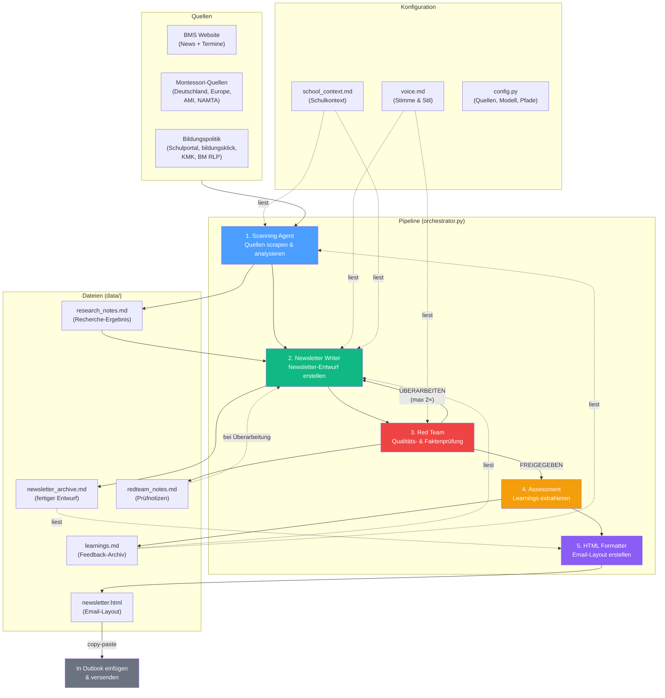

# BMS Newsletter

Automatisierte Newsletter-Generierung für die **Bilinguale Montessori Schule (BMS) Ingelheim** — eine 5-Agenten-Pipeline, die aus aktuellen Quellen einen redaktionell hochwertigen Newsletter erstellt und als HTML-Email formatiert.

## Pipeline-Architektur



## Agenten im Detail

| Agent | Aufgabe | Input | Output |
|---|---|---|---|
| **Scanning** | Scrapet BMS-Website, Montessori-Quellen und Bildungspolitik-Feeds. Analysiert und strukturiert die Inhalte, schlägt roten Faden vor. | URLs aus `config.py`, `school_context.md`, `learnings.md` | `research_notes.md` |
| **Newsletter Writer** | Erstellt den Newsletter-Entwurf nach `voice.md`-Vorgaben. Beachtet Terminologie, Tonalität und Struktur. | `research_notes.md`, `voice.md`, `school_context.md`, `learnings.md` | `newsletter_archive.md` |
| **Red Team** | Prüft in 4 Dimensionen: Fakten & Quellen, Roter Faden & Struktur, Sprache & Ton, Leser-Perspektive. Kann bis zu 2× zur Überarbeitung zurückschicken. | `newsletter_archive.md`, `research_notes.md`, `voice.md` | `redteam_notes.md` + Urteil |
| **Assessment** | Reflektiert die fertige Ausgabe: Was hat funktioniert? Was nicht? Extrahiert konkrete Anweisungen für zukünftige Ausgaben. | `newsletter_archive.md`, `research_notes.md` | `learnings.md` (append) |
| **HTML Formatter** | Konvertiert den fertigen Newsletter in ein gestyltes HTML-Email-Layout (BMS-Farben, Pull-Quotes, Termine-Box). Copy-paste-ready für Outlook. | `newsletter_archive.md` | `newsletter.html` |

## Setup

```bash
pip install -r requirements.txt
cp .env.example .env  # ANTHROPIC_API_KEY eintragen
```

## Nutzung

```bash
# Volle Pipeline (alle 5 Agenten)
python orchestrator.py

# Ab einem bestimmten Agenten neu starten
python orchestrator.py --from write    # Ab Newsletter Writer
python orchestrator.py --from html     # Nur HTML neu generieren

# Nur einen einzelnen Agenten ausführen
python orchestrator.py --only scan     # Nur Scanning
python orchestrator.py --only html     # Nur HTML Formatter
```

Verfügbare Agent-Namen: `scan`, `write`, `redteam`, `assess`, `html`

## Dateistruktur

```
bms-newsletter/
├── orchestrator.py            # Pipeline-Steuerung
├── config.py                  # Quellen-URLs, Modell, Pfade
├── agents/
│   ├── scanning.py            # Quellen-Scraping & Analyse
│   ├── newsletter_writer.py   # Newsletter-Entwurf
│   ├── red_team.py            # Qualitätsprüfung (max 2 Iterationen)
│   ├── assessment.py          # Learnings-Extraktion
│   ├── html_formatter.py      # Markdown → HTML-Email-Layout
│   └── utils.py               # Shared: Claude-Streaming, HTTP-Requests
└── data/
    ├── voice.md               # Stimme & Stil (versioniert)
    ├── school_context.md      # BMS-Schulkontext (versioniert)
    ├── learnings.md           # Akkumuliertes Feedback (lokal)
    ├── research_notes.md      # Recherche-Ergebnis (lokal)
    ├── newsletter_archive.md  # Fertiger Entwurf (lokal)
    ├── redteam_notes.md       # Red-Team-Notizen (lokal)
    └── newsletter.html        # HTML-Email-Layout (lokal)
```

**Versioniert** = in Git. **Lokal** = in `.gitignore`, wird bei jedem Lauf neu erzeugt.

## Redaktionelle Leitplanken

Die Pipeline folgt dem **[Voice & Style Guide](data/voice.md)** — die wichtigsten Regeln:

- **Tonalität:** Chrismon / brand eins — substanziell, warm, nie flach
- **Terminologie:** "Lerngruppe" (nie "Klasse"), "Lernbegleiter:in" (nie "Lehrer:in"), "Stufe" (nie "Klasse")
- **Struktur:** Montessori-Zitat → Begrüßung mit rotem Faden → BMS-News → Montessori-Welt → Bildungspolitik → Termine → Abschluss
- **Neue Themen:** Why–How–What (Kontext vor Detail)
- **Termine:** Immer mit Ort, Uhrzeit, Aktionshinweis für Eltern
- **Sprache:** Deutsch + Englisch wo natürlich, Sie-Form, keine Emojis, kein Jargon

## Manueller Schritt nach der Pipeline

1. HTML prüfen: `data/newsletter.html` im Browser öffnen
2. Redaktionelle Lücken schließen (z.B. `[Raum prüfen]`-Markierungen)
3. HTML in Outlook einfügen und versenden
